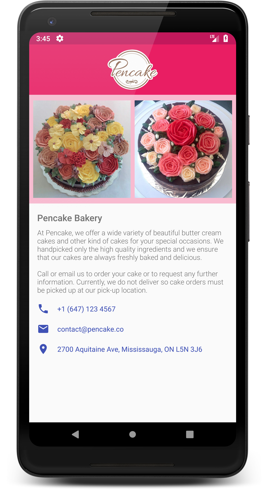

# Single Screen App

**Platform: Android (Min SDK: 19, Target SDK: 27)**

**Author: [Timotius Oktorio](https://ca.linkedin.com/in/timotiusoktorio "LinkedIn Profile") (toktorio@gmail.com)**

A single screen app that displays an about page design of a fictional small business.

*This app is created as the first project of [Android Basics Nanodegree](https://www.udacity.com/course/android-basics-nanodegree-by-google--nd803) program at Udacity.*

### Features
- View a simple and stunning design of an about page.
- Design support for both portrait and landscape orientation.
- Perform a phone call, send an email, or view locations on Google Maps by clicking the contact info links.

### What I have learned from this project
- Creating user interface for Android apps using XML on Android Studio.
- Using ViewGroups to nest elements in order to create complex user interface.
- Sending implicit intents to start an activity in another app using [Common Intents](https://developer.android.com/guide/components/intents-common.html).
- Designing user interface for both portrait and landscape orientation.

 

Get the apk file [here](https://github.com/toktorio/Single-Screen-App/blob/master/app/release/single-screen-app.apk?raw=true) to install the app on your device. Note that depending on your device settings, you might need to allow installation from unknown sources in order to install this app. Visit this [link](https://www.androidcentral.com/unknown-sources) for the detailed instructions.
